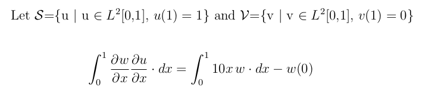

# dune-integrate

Module that uses the [DUNE](https://www.dune-project.org/) library to solve the one-dimensional heat equation using FEM. The problem is taken from the textbook [The Finite Element Method: Linear Static and Dynamic Analysis](https://store.doverpublications.com/0486411818.html)

Problem statement:

Equivalent weak formulation:

