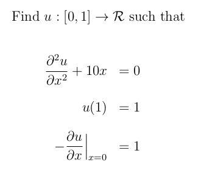

# dune-integrate

Module that uses the [DUNE](https://www.dune-project.org/) library to solve the one-dimensional heat equation using FEM. The problem is taken from the textbook [The Finite Element Method: Linear Static and Dynamic Analysis](https://store.doverpublications.com/0486411818.html). Running this code requires header files from the DUNE library along the CMake build system. Please refer to [src/oned.cc](https://github.com/NageshEranki/dune-integrate/blob/main/src/oned.cc) for the actual implementation of the solution. Output is written to file '1d_solution' as tab-separated values.

## Problem statement:

## Equivalent weak formulation:

## Choice of function spaces:

In this elementary problem, *linear, first-order Lagrangian* elements are used. To illustrate, the following figure shows the plots of the shape functions on the reference element.

Therefore, the trial/test function spaces will be as follows:

